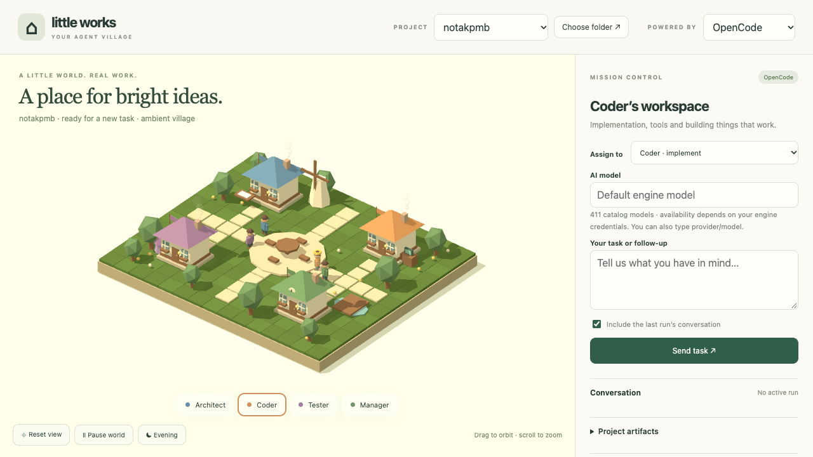

# Little Works · Agent Village

A local 3D village for watching AI coding agents work. Assign a task to an
Architect, Coder, Tester, or Manager — or the full team in sequence — and watch
them walk to their workshops, meet in the square, and report back.



**Local-only. No accounts, no telemetry, no build step.** Python standard
library on the backend, Three.js from CDN on the frontend.

## Getting started

Requirements: **Python 3.10+**, internet access (Three.js CDN), a
WebGL-capable browser. macOS and Linux work; Windows works via WSL
([platforms](docs/troubleshooting.md#platforms)).

```sh
git clone https://github.com/azfardanish/agent-village.git
cd agent-village
sh start.sh
```

Open the printed URL (default <http://127.0.0.1:8787>), pick a project
folder, pick an engine, send a task. Full walkthrough:
[Getting started](docs/getting-started.md) · [Troubleshooting](docs/troubleshooting.md).

You need **OpenCode** and/or **Hermes** already installed and logged in — the
village drives your CLIs, it doesn't replace them.
[Connecting your engine](docs/engines.md) · [Model choice](docs/model-catalog.md) ·
[Other LLM endpoints](docs/openai-compatible.md).

## Docs

- [Architecture](docs/architecture.md) — server, runtime, frontend, run records
- [Sessions](docs/sessions.md) — engine-owned sessions: browse, attach, create, rename, delete
- [Configuration](docs/configuration.md) — `village.json`, defaults, discovery
- [Engine adapters](docs/adapters.md) — the plugin contract + reference behavior
- [runs/*.json format](docs/runs-format.md)
- [3D scene guide](docs/scene-guide.md) — procedural models, houses, offices
- [Packaging & versioning](docs/packaging.md) · [Limitations](docs/limitations.md)
- [Contributing](CONTRIBUTING.md) · [Changelog](CHANGELOG.md)

## Project posture

- **Localhost only** — binds `127.0.0.1`, no auth because there's nothing to
  protect remotely. Never expose it to a network.
- **Stdlib-only backend** — no `pip install`, no framework. Keep it that way
  ([scope](CONTRIBUTING.md#scope-what-belongs-here)).
- **Procedural low-poly** — no model files; geometry is code
  ([scene guide](docs/scene-guide.md)).
- License: MIT ([LICENSE](LICENSE)).
